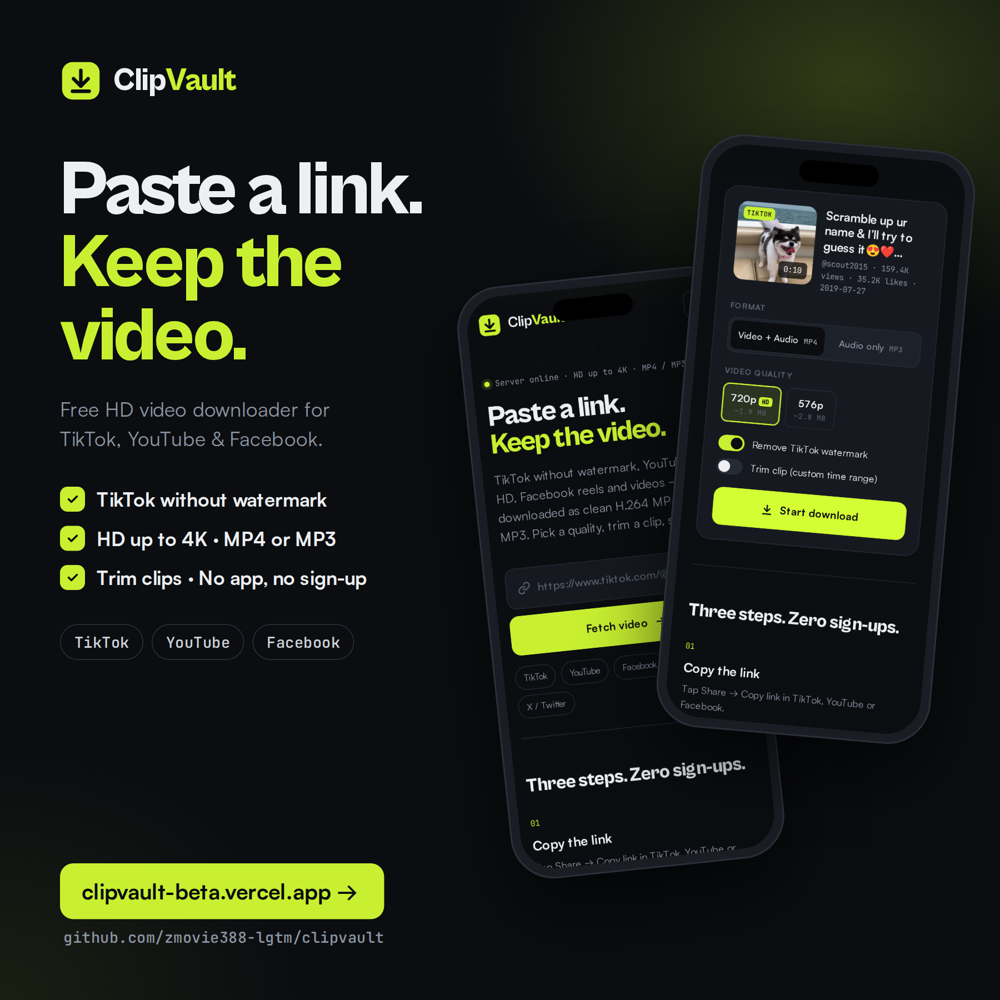

# ClipVault — TikTok, YouTube & Facebook Video Downloader

Smart, high-quality media downloader. Paste a link, pick a quality, save the file.

**Live demo:** https://clipvault-beta.vercel.app

**Android app:** [Download ClipVault.apk](https://github.com/zmovie388-lgtm/clipvault-android/releases/latest/download/ClipVault.apk) · [source](https://github.com/zmovie388-lgtm/clipvault-android)



## Features
- TikTok downloads **without watermark**
- YouTube & Facebook (Watch, Reels, fb.watch) — also Instagram and X
- Real quality picker (360p → 4K) with approximate file sizes
- **Video + Audio (MP4)** merged as phone-friendly H.264/AAC, or **Audio only (MP3)** at 128 / 192 / 320 kbps
- **Trim clip** — download only a custom time range
- Live progress, in-page preview player, auto-save, session history
- Dark / light theme, fully responsive

Powered by [yt-dlp](https://github.com/yt-dlp/yt-dlp) + FFmpeg + FastAPI.

## Project layout
```
app.py            FastAPI backend for Vercel (serverless, bundled FFmpeg via imageio-ffmpeg)
public/           Frontend (HTML / CSS / vanilla JS)
requirements.txt  Python deps
vercel.json       Function config (300 s max duration)
selfhost/         Long-running server version with background jobs + progress polling
```

## Deploy to Vercel
[](https://vercel.com/new/clone?repository-url=https://github.com/zmovie388-lgtm/clipvault)

Or with the CLI: `vercel deploy --prod`

Optional env var:
- `YTDLP_COOKIES` — full contents of a Netscape `cookies.txt` exported from a logged-in YouTube session. Needed because YouTube blocks most cloud IPs with a "confirm you're not a bot" check.
- `MAX_DURATION` — max video length in seconds (default 1800).

## Run locally
```bash
pip install -r requirements.txt
uvicorn app:app --port 8000
# in another terminal
cd public && python -m http.server 5500
```
Open http://localhost:5500 (the frontend calls http://localhost:8000 automatically).

### Self-hosted server version (home PC / VPS)
```bash
cd selfhost/server && pip install fastapi uvicorn yt-dlp && python app.py   # needs ffmpeg installed
cd selfhost/site && python -m http.server 5500
```
Running at home usually makes YouTube work without cookies. Keep yt-dlp updated: `pip install -U yt-dlp`.

## Disclaimer
For downloading public videos you own or have permission to save. Respect creators' rights and each platform's terms of service.
